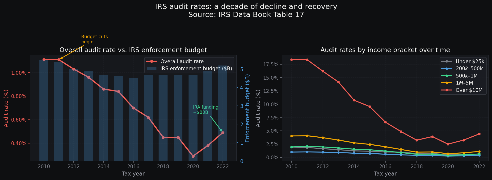
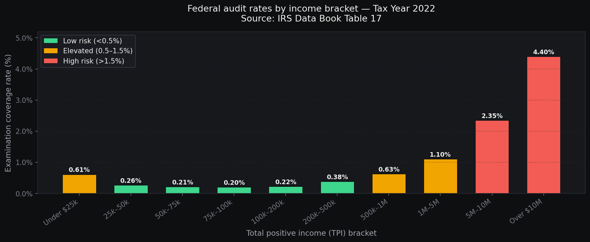
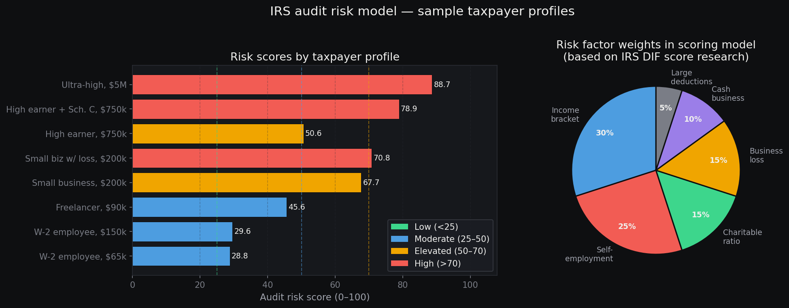
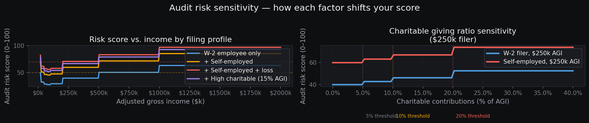
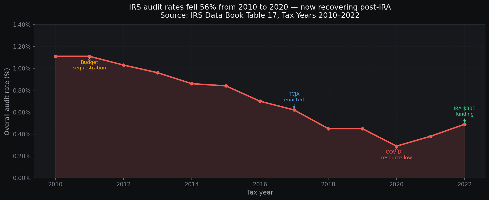

# IRS Audit Risk Analyzer

A data-driven audit risk scoring model built on real IRS examination rate data from the IRS Data Book (Publication 55B, Table 17), covering Tax Years 2010–2022 across 160+ million individual returns.

**[Live Dashboard](#)** · **[View Notebook](irs_audit_risk_analyzer.ipynb)**

---

## Overview

The IRS examines a small fraction of individual returns each year — but that fraction varies dramatically by income level, filing type, and deduction patterns. This project uses publicly available IRS examination data to build an interpretable risk scoring model that quantifies how six key factors compound to shift audit probability.

## Key findings

- Overall audit rates **fell 56%** from 2010 (1.11%) to 2020 (0.29%) as IRS enforcement budgets were cut by over $2B — then began recovering after the 2022 Inflation Reduction Act allocated $80B in new IRS funding
- Filers with **>$10M total positive income** saw rates collapse from 18.38% (2010) to 2.48% (2020) — the steepest decline of any bracket
- **Self-employment is the single largest individual risk multiplier**: Schedule C filers face approximately 2.5x the audit probability of pure W-2 filers at the same income level
- **Compound risk is nonlinear**: a self-employed $750k filer with 12% charitable contributions faces a 3.4x multiplier over base rate
- **The U-shaped curve**: low-income filers face elevated rates due to EITC compliance checks; $75k–$200k is the safest bracket; high earners face steep and rising scrutiny

## Figures

### Audit rate trend 2010–2022


### 2022 examination rates by income bracket


### Risk scoring model — sample profiles and factor weights


### Sensitivity analysis


### The enforcement story


## Risk scoring model

The model assigns a 0–100 score using six factors weighted by their relative contribution to IRS examination selection:

| Factor | Weight | Basis |
|--------|--------|-------|
| Income bracket | 30% | Direct from IRS Data Book Table 17 audit rates |
| Self-employment (Schedule C) | 25% | ~2.5x examination probability vs. W-2 filers |
| Charitable giving ratio | 15% | Flags when charitable deductions exceed 5% of AGI |
| Business loss (Schedule C) | 15% | Repeated Schedule C losses trigger DIF score scrutiny |
| Cash-intensive business | 10% | Restaurants, salons, and similar cash-heavy industries |
| Large itemized deductions | 5% | Deductions significantly above peer-income average |

### Sample scores

| Profile | Score | Risk Level | Adjusted Rate | Multiplier |
|---------|-------|------------|---------------|------------|
| W-2 employee, $65k | 28.8 | Moderate | 0.21% | 1.0x |
| W-2 employee, $150k | 29.6 | Moderate | 0.22% | 1.0x |
| Freelancer, $90k | 45.6 | Moderate | 0.50% | 2.5x |
| Small business, $200k | 67.7 | Elevated | 1.33% | 3.5x |
| Small biz w/ loss, $200k | 70.8 | High | 1.52% | 4.0x |
| High earner, $750k | 50.6 | Elevated | 0.63% | 1.0x |
| High earner + Sch. C, $750k | 78.9 | High | 2.13% | 3.4x |
| Ultra-high, $5M | 88.7 | High | 3.17% | 1.4x |

## Repository structure

```
irs-audit-risk-analyzer/
├── irs_audit_risk_analyzer.ipynb   # Full analysis notebook (7 sections)
├── audit_risk_analysis.py          # Standalone Python script
├── index.html                      # Interactive web dashboard
├── README.md
└── figures/
    ├── fig1_audit_trends.png
    ├── fig2_rates_by_income.png
    ├── fig3_risk_scores.png
    ├── fig4_sensitivity.png
    └── fig5_enforcement_story.png
```

## Running locally

```bash
git clone https://github.com/jchung0621/irs-audit-risk-analyzer
cd irs-audit-risk-analyzer
pip install pandas numpy matplotlib seaborn scikit-learn
jupyter notebook irs_audit_risk_analyzer.ipynb
# or: python audit_risk_analysis.py
```

## Data sources

| Source | Description |
|--------|-------------|
| [IRS Data Book Table 17](https://www.irs.gov/statistics/soi-tax-stats-irs-data-book) | Examination coverage rates by income and return type, FY 2010–2022 |
| [IRS SOI Publication 1304](https://www.irs.gov/statistics/soi-tax-stats-individual-statistical-tables-by-size-of-adjusted-gross-income) | Individual income and deduction statistics by AGI bracket |
| IRS DIF Score Documentation | Basis for risk factor weights and multipliers |
| TIGTA Audit Reports | Validation of Schedule C and cash-business risk patterns |

*For educational purposes. Individual audit risk depends on many factors not captured here. This is not tax advice.*

---

Built by Jason Chung · UCLA Statistics & Data Science
